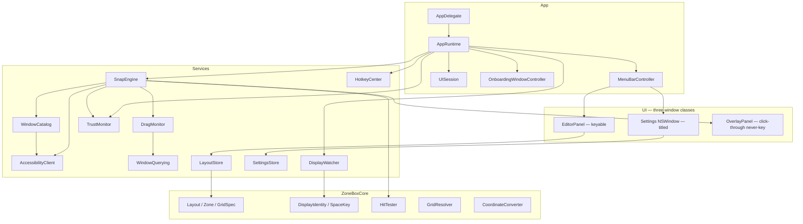
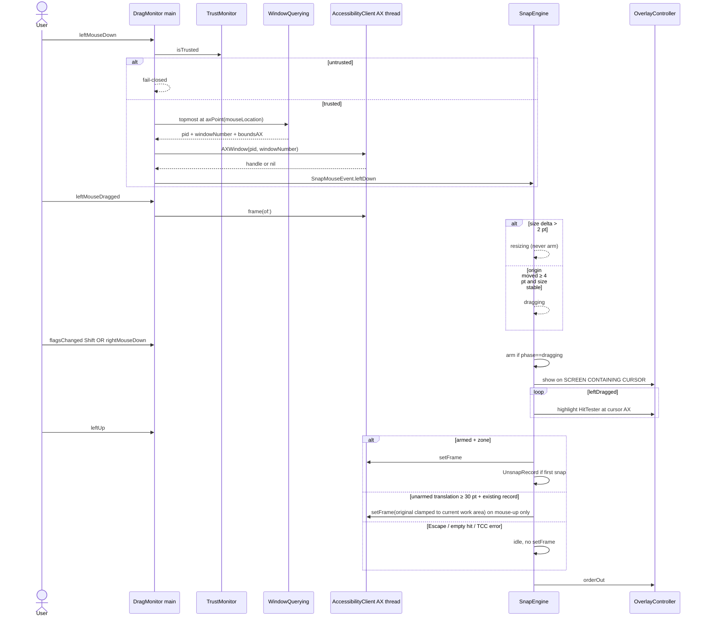
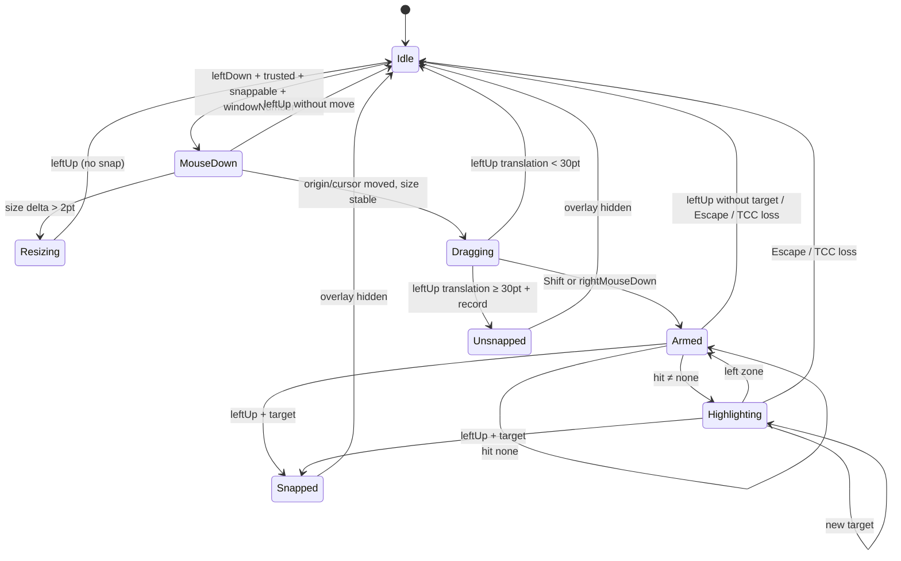
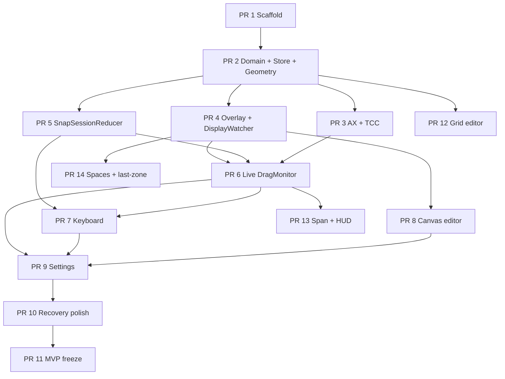

# ZoneBox for macOS — Design Document

| Field | Value |
| --- | --- |
| **Title** | ZoneBox: FancyZones-style window zones for macOS |
| **Author** | TBD (copyright holder) |
| **Date** | 2026-08-27 |
| **Status** | Draft (revision 4 — user decisions: ZoneBox, proprietary, Developer ID) |
| **Product name (display)** | **ZoneBox** |
| **Bundle ID** | `com.fancyzone.app` (kept until a domain is owned; do **not** silently switch to `com.zonebox.app`) |
| **Repo** | `/Users/wyman/Documents/fancyzone_mac` (greenfield; **no application code on disk**) |
| **Primary UI** | AppKit (**no SwiftUI in MVP modules**) |
| **Language** | Swift 5.10 (`SWIFT_STRICT_CONCURRENCY=targeted`, treated as warnings until MVP) |
| **Deployment target** | macOS 14.0 (Sonoma) |
| **Distribution (v1)** | Developer ID + notarization; sandbox **off**; **not** Mac App Store |
| **License** | **Proprietary — All Rights Reserved** (not MIT, not Apache, not GPL) |

This document is the implementation spec. After approval, PR 1 scaffolds the Xcode/AppKit project. Subsequent PRs follow the DAG in [PR Plan](#pr-plan), which is written for `/execute-plan`.

---

## Overview

Windows PowerToys FancyZones lets a user draw **zones** on a monitor, then snap windows into those rectangles with Shift-drag, keyboard, or layout hotkeys. macOS has no equivalent in AppKit or Mission Control. Paid Mac apps (BentoBox) and a GPL-3.0 open-source app (MacsyZones) prove the product is viable; the hard parts are **Accessibility window moving**, **drag detection of foreign windows**, **display identity across cable/GPU changes**, and **Spaces** (no public Space ID).

**ZoneBox** is a **native AppKit menu-bar utility** that ports the FancyZones *model* (layout = ordered zones on a work area; Grid vs Canvas; snap-on-drop; restore-on-unsnap) and borrows BentoBox’s *product polish* (per-display active layout, spanning later, robust display matching). User-visible name is **ZoneBox**; the process bundle ID remains **`com.fancyzone.app`**. **We will not fork or copy MacsyZones.** MacsyZones is GPL-3.0. Feature lists and public Apple API names are fair game; types, file structure, and code are original. ZoneBox itself is **closed-source / All Rights Reserved** so the owner retains exclusive commercial rights (BentoBox-style paid Mac indie). MIT would allow anyone to fork and sell the same app.

v1 is a reliable **Canvas** editor + Shift/`rightMouseDown`-while-drag snap + keyboard snap 1–9, with Grid as a **data model and template resolver** (no Grid split/merge editor until v1.1). Persistence is versioned JSON under Application Support. Accessibility is **fail-closed** and onboarded with a blocking sheet in the same PR that introduces AX (PR 3).

Snap overlay, layout editor, and Settings are **three different window classes** with different key/mouse/level/activation rules. Overlay follows the **cursor’s screen**, not the dragged window’s center.

---

## Background & Motivation

### Current state

The workspace is empty. There is no existing architecture to extend. Comparable Mac software:

| Product | Model | Notes for us |
| --- | --- | --- |
| **PowerToys FancyZones** | Layouts of zones; Grid (relative split/merge) and Canvas (absolute, may overlap); templates Focus / Columns / Rows / Grid / Priority Grid | Product we match. JSON under `%LocalAppData%\Microsoft\PowerToys\FancyZones\`. Overlap: smallest, largest, split overlap, closest-center-to-cursor. |
| **BentoBox** (~$9, macOS 14.6+) | Tiled (= Grid) and Windowed (= Canvas); per-display **and** per-Space; Shift or right-click snap; per-zone shortcuts; multi-zone span; restore size on unsnap | Polish target. Display matching is their hardest bug; v1.1.10 added guided recovery. Does **not** import FancyZones JSON. |
| **MacsyZones** (GPL-3.0) | Overlapping zones + Grid; Snap Key; right-click; shake-to-snap; Quick Snapper HUD | **Do not copy.** Lessons only: AX on a dedicated run-loop thread, overlay panels, JSON in Application Support, AX top-left vs AppKit bottom-left, retries for “problematic” windows. |
| **Rectangle** (MIT) | Keyboard + edge snap, not arbitrary zones | Best *legal* reference for AX `setFrame` (size→position→size, `AXEnhancedUserInterface` off). Cite the technique, do not copy files. |

### Pain points

1. macOS Snap / Tile (Stage Manager, Sequoia tiling) is not custom zones and not Canvas-overlap.
2. Rectangle/Magnet presets are not user-drawn layouts.
3. BentoBox is closed-source; MacsyZones cannot be a starting point without GPL infection.
4. Display reconnects and “Displays have separate Spaces” break naive `NSScreen.localizedName` keys.

### What “good” looks like (product)

A user with an ultrawide plus a laptop:

1. Grants Accessibility once (**then quits and reopens ZoneBox** if the grant does not take — TCC can be stale until relaunch).
2. Picks “Columns 3” on the ultrawide, draws a Canvas editor+terminal+browser layout on the laptop.
3. Shift-drags any standard window; overlay appears **on the screen containing the cursor**; drop snaps to the highlighted zone, inset by gutter, clamped to `visibleFrame`.
4. Control+Option+1..9 snaps the focused window (paused while VoiceOver is on); Control+Option+[ / ] cycles windows in the same zone by last-snap time.
5. Unsnap hotkey restores the pre-snap frame. Unarmed drag ≥ 30 pt restores **on mouse-up** (never mid-drag).
6. Unplugging the ultrawide and plugging it back applies the same layout via **display UUID**, unless identity is ambiguous — then a recovery sheet.

---

## Goals & Non-Goals

### Goals (MVP / v1)

1. Menu-bar accessory app (`LSUIElement` + `.accessory`), optional launch-at-login (`SMAppService.mainApp`), **Snap Enabled** toggle.
2. Blocking Accessibility onboarding **before any AX / global-mouse use** (PR 3): System Settings URL + poll + fail-closed.
3. Built-in templates (columns 2/3, rows 2/3, 2×2, priority-style 3-zone, focus/center) plus **Canvas** custom layouts with a keyable overlay editor, including **Convert to Canvas**.
4. Shift+drag snap: overlay, hover highlight, drop → AX position+size. **Move only, not resize.**
5. `rightMouseDown` during an existing left-drag as an alternate snap trigger.
6. Keyboard: snap focused window to zone 1–9; next/prev zone; cycle windows in the same zone; unsnap.
7. Per-display active layout keyed by `DisplayIdentity` (UUID first); JSON persistence; schema version.
8. Restore original AX frame on unsnap (in-memory; identity **requires** `(pid, CGWindowID)`).
9. Settings window (titled `NSWindow`): triggers, gutter, overlay appearance, excluded bundle IDs, launch-at-login.
10. Multi-monitor: independent layout per display; overlay on the **cursor’s** screen.
11. `os.Logger`; XCTest for geometry, hit-testing, persistence, coordinate conversion, display matching, snap state machine (no live AX required).

### Goals (v1.1 — designed now, PRs 12–14)

- Grid editor (split/merge).
- Adjacent-zone spanning + Quick Snap HUD.
- Per-Space layouts (private CGS via `dlsym`), last-known-zone for new windows, keep-in-zone on reconfiguration.

### Goals (v1.2 — out of this PR Plan)

- Quick layout switch by number.
- Per-zone custom hotkeys.
- Optional always-on snap-while-dragging.
- Snap resizers between adjacent edges.
- Shake-to-snap (off by default).

### Explicit non-goals

- Not a tiling window manager (no yabai/Amethyst automatic tiling).
- Not importing Windows FancyZones JSON in v1.
- **No SwiftUI in MVP modules** (App, Domain, Geometry, Services, UI). No `MenuBarExtra`, no SwiftUI `Settings` scene, no “tiny control” exception in v1.
- Not forking or copying MacsyZones (GPL-3.0).
- Not iOS / iPadOS / Catalyst.
- Not window grouping, tabs, or replacing Mission Control / Stage Manager.
- **Not compatible-by-promise with Stage Manager or Sequoia tiled halves in v1** (known-broken / best-effort; see §14).
- Not posting synthetic `CGEvent`s.
- Not Mac App Store in v1.
- Not Screen Recording TCC in v1 (no window titles from `kCGWindowName`).
- Not Input Monitoring / `CGEventTap` in v1.
- Not AXObserver in v1 (NSEvent + CGWindowList + terminate notifications are the session trigger).

---

## Proposed Design

### 1. Project topology (greenfield)

**Build system:** **XcodeGen** (`project.yml`) is the source of truth. PR 1 also **commits the generated `ZoneBox.xcodeproj`** so the first human checkpoint is `open ZoneBox.xcodeproj` with no extra tools. `make project` regenerates after file-tree changes.

| Item | Value |
| --- | --- |
| Bundle ID | `com.fancyzone.app` (display name ZoneBox; keep this ID until a domain is owned — changing after notarization is painful) |
| Product name | ZoneBox (`CFBundleName` / `CFBundleDisplayName`) |
| Signing | Developer ID Application (Automatic for local Debug) |
| Deployment | macOS 14.0 |
| Sandbox | **Off** (entitlement absent) |
| Hardened Runtime | **On** |
| `LSUIElement` | `true` |
| Activation policy | `.accessory` at launch; **temporary `.regular`** while Editor or Settings is open |
| `GENERATE_INFOPLIST_FILE` | **NO** |
| `SWIFT_STRICT_CONCURRENCY` | `targeted` |
| Status item image | SF Symbol `rectangle.split.3x1` (`isTemplate = true`) |

**Targets**

| Target | Type | Role |
| --- | --- | --- |
| `ZoneBoxCore` | static library | Domain + Geometry + `LayoutStore` + `SettingsStore`. **No AppKit.** Logic-tested without launching `NSApplication`. |
| `ZoneBox` | application | App + Services + UI; depends on Core |
| `ZoneBoxTests` | unit-test bundle | Depends on **Core only** (no `TEST_HOST`, no `BUNDLE_LOADER`). AppDelegate `@main` never runs under XCTest. |

Proposed **v1** tree (created across PRs 1–11; **none of these files exist today**). v1.1 files are listed only under PRs 12–14.

```
fancyzone_mac/
  README.md
  LICENSE
  .gitignore
  Makefile
  project.yml
  scripts/bootstrap.sh
  .github/workflows/ci.yml
  ZoneBox.xcodeproj/                  # generated; committed in PR 1
  ZoneBox/
    App/
      AppDelegate.swift
      AppRuntime.swift
      MenuBarController.swift
      UISession.swift
    Domain/                             # compiled into ZoneBoxCore
      Layout.swift
      Zone.swift
      LayoutKind.swift
      LayoutTemplates.swift
      DisplayIdentity.swift
      SpaceKey.swift
      SnapSession.swift
      SnapSessionReducer.swift
      SnapTarget.swift
      SnapMouseEvent.swift
      WindowIdentity.swift
      AppSettings.swift
      StoreDocument.swift
    Geometry/                           # compiled into ZoneBoxCore
      NormalizedRect.swift
      WorkArea.swift
      CoordinateConverter.swift
      HitTester.swift
      OverlapPolicy.swift
      GridResolver.swift
      Gutter.swift
      RectMath.swift
    Services/
      Logging.swift
      LayoutStore.swift                 # Core
      SettingsStore.swift               # Core
      DisplayWatcher.swift
      LoginItemService.swift
      HotkeyCenter.swift
      WindowCatalog.swift
      DragMonitor.swift
      SnapEngine.swift
      OverlayController.swift
      TrustMonitor.swift
      Accessibility/
        AccessibilityClient.swift
        AccessibilityClientLive.swift
        AXWindow.swift
        AXRunLoop.swift
        AXFrameMutator.swift
        WindowQuerying.swift
        CGWindowQuery.swift
    UI/
      Editor/
        LayoutEditorController.swift
        EditorPanel.swift
        LayoutEditorCanvasView.swift
        ZoneChromeView.swift
      Settings/
        SettingsWindowController.swift
        TriggersPaneController.swift
        AppearancePaneController.swift
        LayoutsPaneController.swift
        ExclusionsPaneController.swift
        GeneralPaneController.swift
      Onboarding/
        OnboardingWindowController.swift
      Overlay/
        OverlayPanel.swift
        ZoneOverlayView.swift
    Resources/
      Assets.xcassets
      Info.plist
    ZoneBox.entitlements
  ZoneBoxTests/
    GeometryTests.swift
    HitTesterTests.swift
    CoordinateConverterTests.swift
    GridResolverTests.swift
    LayoutStoreTests.swift
    DisplayIdentityTests.swift
    SnapEngineTests.swift              # Core-only: SnapSessionReducer, not @MainActor SnapEngine
    AppSettingsTests.swift
    Fakes/
      FakeScreen.swift
      TemporaryStore.swift
```

`project.yml` sketch:

```yaml
name: ZoneBox
options:
  bundleIdPrefix: com.fancyzone
  deploymentTarget:
    macOS: "14.0"
  createIntermediateGroups: true
settings:
  base:
    SWIFT_VERSION: "5.10"
    MACOSX_DEPLOYMENT_TARGET: "14.0"
    ENABLE_HARDENED_RUNTIME: YES
    ENABLE_USER_SCRIPT_SANDBOXING: NO
    SWIFT_STRICT_CONCURRENCY: targeted
    GENERATE_INFOPLIST_FILE: NO
targets:
  ZoneBoxCore:
    type: library.static
    platform: macOS
    sources:
      - path: ZoneBox/Domain
      - path: ZoneBox/Geometry
      - path: ZoneBox/Services/LayoutStore.swift
      - path: ZoneBox/Services/SettingsStore.swift
      - path: ZoneBox/Services/Logging.swift
  ZoneBox:
    type: application
    platform: macOS
    sources:
      - path: ZoneBox
        excludes:
          - Domain/**
          - Geometry/**
          - Services/LayoutStore.swift
          - Services/SettingsStore.swift
          - Services/Logging.swift
    dependencies:
      - target: ZoneBoxCore
    settings:
      base:
        PRODUCT_BUNDLE_IDENTIFIER: com.fancyzone.app
        INFOPLIST_FILE: ZoneBox/Resources/Info.plist
        GENERATE_INFOPLIST_FILE: NO
        CODE_SIGN_ENTITLEMENTS: ZoneBox/ZoneBox.entitlements
        ASSETCATALOG_COMPILER_APPICON_NAME: AppIcon
        COMBINE_HIDPI_IMAGES: YES
    entitlements:
      path: ZoneBox/ZoneBox.entitlements
  ZoneBoxTests:
    type: bundle.unit-test
    platform: macOS
    sources: [ZoneBoxTests]
    dependencies:
      - target: ZoneBoxCore
    settings:
      base:
        GENERATE_INFOPLIST_FILE: YES
        # No TEST_HOST. Logic tests only. No @testable import of the app.
schemes:
  ZoneBox:
    build:
      targets:
        ZoneBox: all
        ZoneBoxCore: [test]
        ZoneBoxTests: [test]
    test:
      targets:
        - ZoneBoxTests
```

Without the `schemes.test.targets` entry, `xcodebuild -scheme ZoneBox test` would run **zero** tests: the unit-test bundle depends on the static library, not the app, so XcodeGen would not attach it to the app scheme. The block above is **required** so Makefile/CI/DoD actually execute golden-vector and reducer tests. **Do not** put `SnapEngine` (AppKit/AX) into Core. **Do not** reintroduce `TEST_HOST` for this suite.

`Info.plist` keys (hand-written; `GENERATE_INFOPLIST_FILE = NO` on the app):

```xml
<key>CFBundleIdentifier</key><string>$(PRODUCT_BUNDLE_IDENTIFIER)</string>
<key>CFBundleName</key><string>ZoneBox</string>
<key>CFBundleDisplayName</key><string>ZoneBox</string>
<key>CFBundlePackageType</key><string>APPL</string>
<key>LSMinimumSystemVersion</key><string>14.0</string>
<key>LSUIElement</key><true/>
<key>NSHighResolutionCapable</key><true/>
<key>NSPrincipalClass</key><string>NSApplication</string>
```

Do **not** treat `NSAccessibilityUsageDescription` as a required TCC key. Accessibility is not Camera-style usage-string gated; the string is optional and ignored if present. Do **not** add `NSAppleEventsUsageDescription` unless a future PR sends Apple Events.

`ZoneBox.entitlements` is an empty dict. No `com.apple.security.app-sandbox`. No `com.apple.security.automation.apple-events`.

`LICENSE` (PR 1, proprietary — **not** MIT/Apache/GPL):

```
Copyright (c) 2026 [Copyright Holder]. All Rights Reserved.

This software is proprietary and confidential. No license is granted
to copy, modify, merge, publish, distribute, sublicense, and/or sell
copies of the Software, except as the copyright holder may agree in
writing. Use of this repository is the copyright holder’s own
development of ZoneBox.

This project must not incorporate MacsyZones or any other GPL-licensed
source. Third-party components, if added later, keep their own licenses.
```

`AppDelegate` `@main` must no-op monitors when launched under XCTest (defense in depth even though tests link Core only):

```swift
@main
final class AppDelegate: NSObject, NSApplicationDelegate {
    func applicationDidFinishLaunching(_ notification: Notification) {
        if ProcessInfo.processInfo.environment["XCTestConfigurationFilePath"] != nil { return }
        NSApp.setActivationPolicy(.accessory)
        runtime.isEditorOpen = false
        runtime.start()
    }
    func applicationWillTerminate(_ notification: Notification) {
        runtime.hideAllOverlays()
        runtime.teardown()
    }
}
```

#### TCC flow (PR 3 — fail-closed)

`AXIsProcessTrustedWithOptions` does **not** deep-link to Privacy → Accessibility. `kAXTrustedCheckOptionPrompt` only asks the system to *inform* the user asynchronously; the return value is the current boolean.

Sequence:

1. `TrustMonitor.isTrusted()` → `AXIsProcessTrusted()`. If true, continue.
2. Else present `OnboardingWindowController` (blocking, keyable; uses `UISession.enterRegular()`).
3. Button **Open System Settings** opens, in order, until one succeeds:
   - `x-apple.systempreferences:com.apple.preference.security?Privacy_Accessibility`
   - `x-apple.systempreferences:com.apple.settings.PrivacySecurity.extension?Privacy_Accessibility`
   - `NSWorkspace.shared.open(URL(string: "x-apple.systempreferences:com.apple.preference.security")!)`
4. Optionally also call `AXIsProcessTrustedWithOptions([kAXTrustedCheckOptionPrompt: true])` so macOS may show its generic alert. **Do not claim this opens the Accessibility pane.**
5. Poll `AXIsProcessTrusted()` every 500 ms on the **main** queue while the sheet is visible.
6. Copy on the sheet: “After you enable ZoneBox, **quit and reopen** the app if snapping still does nothing. macOS sometimes does not apply Accessibility until relaunch.”
7. If the user dismisses without granting: menu bar stays up; **every** drag-arm, hotkey snap, cycle, and unsnap returns immediately (`TrustMonitor.failClosed`). Status item uses a warning badge / filled symbol.
8. Recheck trust on **every arm/snap attempt**, not on `didBecomeActive` (accessory apps almost never become active).
9. `kAXErrorAPIDisabled`, `kAXErrorCannotComplete`, `kAXErrorInvalidUIElement` on the AX thread → cancel `SnapSession` to `idle`, `orderOut` overlays, drop the `AXWindow` handle. Treat `APIDisabled` as TCC loss.
10. If trust is re-granted without relaunch, `TrustMonitor` flips to trusted and subsequent snaps proceed; if AX still fails, keep showing the quit-and-reopen copy.

Global `NSEvent.addGlobalMonitorForEvents` for **other processes’** mouse events requires Accessibility. PR 3 therefore ships onboarding **before** PR 6 installs monitors.

### 2. Layering



Rules:

- **Core (Domain + Geometry + stores) has zero AppKit imports.** `CGRect`/`CGPoint` from CoreGraphics only.
- **Services** may import AppKit (`NSEvent`, `NSScreen`, `NSPanel`) but not UI controllers.
- **UI** talks to `AppRuntime` / stores, never to `AXUIElement`.
- **AccessibilityClient** is the only type that imports `ApplicationServices` / `AXUIElement`.
- **`WindowQuerying`** is a protocol so CGWindowList is fakeable.

### 3. Domain types

```swift
struct NormalizedRect: Codable, Hashable, Sendable {
    var x: Double
    var y: Double
    var width: Double
    var height: Double

    func clamped() -> NormalizedRect  // [0,1], min size 0.02
    func denormalize(in workAreaAX: CGRect) -> CGRect
    static func normalize(_ axRect: CGRect, in workAreaAX: CGRect) -> NormalizedRect
}

struct Zone: Codable, Hashable, Identifiable, Sendable {
    var id: UUID
    var number: Int                 // 1-based, unique per layout
    var name: String?
    var canvasRect: NormalizedRect? // required iff layout.kind == .canvas
}

enum LayoutKind: String, Codable, Sendable { case canvas, grid }

enum GridValidationError: Error, Equatable {
    case empty
    case tooLarge                       // rows or columns > 16
    case weightCountMismatch
    case nonPositiveWeight
    case weightsMustSumTo10000(actual: Int)
    case cellMapShape
    case indexOutOfRange(Int)
    case missingIndex(Int)
    case nonRectangularMerge(index: Int) // U-shape / hole
    case zoneCountMismatch
    case zoneNumbersNotPacked            // must be exactly 1...n unique
}

struct GridSpec: Codable, Hashable, Sendable {
    var rows: Int
    var columns: Int
    var rowWeights: [Int]       // count == rows, each > 0, sum == 10_000
    var columnWeights: [Int]
    /// `cellMap[row][col] = zoneIndex` (0-based into `Layout.zones`).
    var cellMap: [[Int]]

    func validated() throws -> GridSpec
}

struct Layout: Codable, Hashable, Identifiable, Sendable {
    var id: UUID
    var name: String
    var kind: LayoutKind
    var zones: [Zone]
    var grid: GridSpec?         // required iff kind == .grid
    var createdAt: Date
    var updatedAt: Date

    func convertingGridToCanvas(workAreaAX: CGRect) throws -> Layout
}

enum OverlapPolicy: String, Codable, Sendable, CaseIterable {
    case smallestArea
    case largestArea
    case closestCenterToCursor
}

struct KeyChord: Codable, Hashable, Sendable {
    var keyCode: UInt16
    var carbonModifiers: UInt32
}

struct AppSettings: Codable, Equatable, Sendable {
    var schemaVersion: Int
    var snapEnabled: Bool
    var snapOnShiftDrag: Bool
    var snapOnRightClickDrag: Bool
    var gutterPoints: Int
    var overlapPolicy: OverlapPolicy
    var showZoneNumbers: Bool
    var inactiveFillOpacity: Double
    var activeFillOpacity: Double
    var zoneFillColorHex: String
    var zoneBorderColorHex: String
    var restoreSizeOnUnsnap: Bool
    var snapDialogs: Bool
    var excludedBundleIDs: [String]
    var launchAtLogin: Bool
    var editorHotkey: KeyChord
    var snapZoneHotkeysEnabled: Bool
    var nextZoneHotkey: KeyChord
    var previousZoneHotkey: KeyChord
    var cycleForwardHotkey: KeyChord
    var cycleBackwardHotkey: KeyChord
    var unsnapHotkey: KeyChord
}

struct DisplayIdentity: Codable, Hashable, Identifiable, Sendable {
    var id: UUID
    /// ColorSync `CGDisplayCreateUUIDFromDisplayID`. Nil during reconfigure / virtual displays.
    var uuid: UUID?
    var lastCGDisplayID: UInt32          // hint only
    var vendorNumber: UInt32
    var productNumber: UInt32
    var serialNumber: UInt32
    var localizedName: String
    var visibleWidth: Double
    var visibleHeight: Double
    var backingScale: Double
}

/// Public AppKit has no Space ID. v1 always `spaceUUID == nil` (all spaces on this display).
struct SpaceKey: Codable, Hashable, Sendable {
    var displayID: DisplayIdentity.ID
    var spaceUUID: String?
}

struct LayoutAssignment: Codable, Hashable, Sendable {
    var space: SpaceKey
    var layoutID: Layout.ID
}

struct StoreDocument: Codable, Equatable, Sendable {
    var schemaVersion: Int
    var layouts: [Layout]
    var displays: [DisplayIdentity]
    var assignments: [LayoutAssignment]
}

struct WorkArea: Equatable, Sendable {
    var display: DisplayIdentity
    var frameAppKit: CGRect
    var visibleFrameAppKit: CGRect
    var backingScale: CGFloat
}

/// Stable in-memory key. `windowNumber` is REQUIRED. Never includes a title.
struct WindowIdentity: Hashable, Sendable {
    var pid: pid_t
    var windowNumber: UInt32
    var bundleID: String?
}

enum SnapTarget: Equatable, Sendable {
    case none
    case zone(ResolvedZone)
}

struct ResolvedZone: Equatable, Sendable {
    var zoneID: UUID
    var number: Int
    var frameAX: CGRect
}

struct UnsnapRecord: Sendable {
    var identity: WindowIdentity
    var originalFrameAX: CGRect
    var snappedFrameAX: CGRect
    var zoneIDs: [UUID]
    var snappedAt: Date
}

enum SnapSessionPhase: Equatable, Sendable {
    case idle
    case mouseDown(WindowIdentity, originAX: CGRect)
    case dragging(WindowIdentity)          // move (size stable)
    case resizing                          // size changed; never snap
    case armed(WindowIdentity)
    case highlighting(WindowIdentity, SnapTarget)
}

/// Pure Core reducer. No AppKit, no AX. `SnapEngineTests` call this — they cannot see app-target `SnapEngine`.
enum SnapEffect: Equatable, Sendable {
    case none
    case showOverlay(displayID: UUID)      // DisplayIdentity.id of cursor work area
    case hideOverlay
    case highlight(SnapTarget)
    case applyFrame(WindowIdentity, CGRect) // snap or unsnap restore; AX happens in the app
    case recordUnsnap(UnsnapRecord)
    case cancel
}

struct SnapReducerInput: Equatable, Sendable {
    var phase: SnapSessionPhase
    var event: SnapMouseEvent
    var workAreas: [WorkArea]
    var primaryFlipHeight: CGFloat
    var window: WindowIdentity?
    var downFrameAX: CGRect?
    var currentFrameAX: CGRect?
    var resolvedZones: [ResolvedZone]
    var unsnapRecord: UnsnapRecord?
    var trusted: Bool
    var snapEnabled: Bool
    var isEditorOpen: Bool
    var restoreSizeOnUnsnap: Bool
}

struct SnapReducerOutput: Equatable, Sendable {
    var phase: SnapSessionPhase
    var effects: [SnapEffect]
}

enum SnapSessionReducer {
    static func reduce(_ input: SnapReducerInput) -> SnapReducerOutput
}

struct SnapModifiers: OptionSet, Sendable, Hashable {
    let rawValue: UInt
    static let shift   = SnapModifiers(rawValue: 1 << 0)
    static let control = SnapModifiers(rawValue: 1 << 1)
    static let option  = SnapModifiers(rawValue: 1 << 2)
    static let command = SnapModifiers(rawValue: 1 << 3)
}

struct SnapMouseEvent: Equatable, Sendable {
    enum Kind: Equatable, Sendable {
        case leftDown, leftDragged, leftUp
        case rightDown          // NSEvent.type == .rightMouseDown (not otherMouseDown)
        case flagsChanged
        case escape
    }
    var kind: Kind
    var locationAppKit: CGPoint
    var modifiers: SnapModifiers
}
```

**`AppSettings.default` (every field):**

| Field | Default |
| --- | --- |
| `schemaVersion` | `1` |
| `snapEnabled` | `true` |
| `snapOnShiftDrag` | `true` |
| `snapOnRightClickDrag` | `true` |
| `gutterPoints` | `16` |
| `overlapPolicy` | `.smallestArea` |
| `showZoneNumbers` | `true` |
| `inactiveFillOpacity` | `0.20` |
| `activeFillOpacity` | `0.40` |
| `zoneFillColorHex` | `"#007AFF"` |
| `zoneBorderColorHex` | `"#FFFFFF"` |
| `restoreSizeOnUnsnap` | `true` |
| `snapDialogs` | `false` |
| `launchAtLogin` | `false` |
| `snapZoneHotkeysEnabled` | `true` |
| `excludedBundleIDs` | see table below |
| hotkeys | Control+Option + codes in §12 |

**Default deny list** (Finder remains snappable):

```
com.apple.dock
com.apple.controlcenter
com.apple.notificationcenterui
com.apple.systempreferences
com.apple.Settings
com.apple.loginwindow
com.apple.Wallpaper
com.apple.Spotlight
com.apple.screencaptureui
com.apple.WindowManager
com.fancyzone.app
```

**Gutter semantics:** each resolved zone is `insetBy(dx: gutter, dy: gutter)`. Adjacent windows therefore have a **2 × gutter** gap. That matches FancyZones “Space around zones” (the value is a per-zone margin, not a shared-edge half-gap). Negative gutter expands zones and is allowed; clamp to the work area afterward.

**JSON encoder** (both files):

```swift
let encoder = JSONEncoder()
encoder.outputFormatting = [.prettyPrinted, .sortedKeys]
encoder.dateEncodingStrategy = .iso8601
encoder.outputFormatting.insert(.withoutEscapingSlashes) // optional
```

Decoder: `.iso8601` dates, `decodeIfPresent` for future keys.

**Zone numbering:** 1-based, packed on delete. Keyboard 1–9 maps to `Zone.number`. `GridResolver` uses `zones[cellIndex].id` and **`zones[cellIndex].number`**, never `idx + 1`.

**Canvas vs Grid:**

- Canvas: `zones[i].canvasRect` authoritative; `grid == nil`.
- Grid: `grid` authoritative; `zones[i]` corresponds to `cellMap` value `i`; `canvasRect == nil`.

**`Layout.convertingGridToCanvas(workAreaAX:)`:** resolve with `gutter: 0`, `NormalizedRect.normalize` each frame into `canvasRect`, set `kind = .canvas`, `grid = nil`. Used by the editor’s **Convert to Canvas** (PR 8).

**`GridSpec.validated()` invariants:**

1. `1...16` rows and columns.
2. `rowWeights.count == rows`, `columnWeights.count == columns`.
3. Every weight `> 0`; each array sums to **exactly 10_000**.
4. `cellMap` is `rows × columns`.
5. Every entry ∈ `0..<zonesCount`.
6. Every index in `0..<zonesCount` appears ≥ 1 time.
7. For each index, cells form a **filled rectangle**: let bounding box `[r0...r1] × [c0...c1]`; every cell inside equals `index`; no cell outside equals `index`. Reject U-shapes / holes with `.nonRectangularMerge`.
8. Caller also checks `layout.zones.count` equals unique indices and numbers are packed `1...n`.

### 4. Layout geometry

Work area is **`NSScreen.visibleFrame` converted to AX space with `primaryFlipHeight`**, never `frame`.

```swift
enum Gutter {
    static func apply(_ rect: CGRect, gutter: CGFloat, workAreaAX: CGRect) -> CGRect {
        rect.insetBy(dx: gutter, dy: gutter).intersection(workAreaAX)
    }
}

func resolveCanvas(layout: Layout, workAreaAX: CGRect, gutter: CGFloat) -> [ResolvedZone] {
    layout.zones.sorted { $0.number < $1.number }.compactMap { zone in
        guard let n = zone.canvasRect else { return nil }
        var r = n.denormalize(in: workAreaAX)
        r = Gutter.apply(r, gutter: gutter, workAreaAX: workAreaAX)
        guard r.width >= 40, r.height >= 40 else { return nil }
        return ResolvedZone(zoneID: zone.id, number: zone.number, frameAX: r)
    }
}

enum GridResolver {
    static func resolve(spec: GridSpec, zones: [Zone], workAreaAX: CGRect, gutter: CGFloat) throws -> [ResolvedZone] {
        let spec = try spec.validated()
        // ... prefix sums ...
        return try indexToCells.keys.sorted().map { idx in
            guard zones.indices.contains(idx) else { throw GridValidationError.zoneCountMismatch }
            // rectangle bounds from cells → unguttered CGRect in workAreaAX
            let unguttered = CGRect(...)
            let frame = Gutter.apply(unguttered, gutter: gutter, workAreaAX: workAreaAX)
            return ResolvedZone(zoneID: zones[idx].id, number: zones[idx].number, frameAX: frame)
        }
    }
}
```

**Templates** (`LayoutTemplates.swift`) return `Layout` values, mostly `kind: .grid`:

| Template | Spec |
| --- | --- |
| Columns 2 | 1×2, `[10000]` × `[5000,5000]`, `[[0,1]]` |
| Columns 3 | 1×3, `[3333,3334,3333]` |
| Rows 2 / 3 | transpose |
| Grid 2×2 | 2×2 equal |
| Priority 3 | `cellMap = [[0,1],[0,2]]`, col `[5000,5000]`, row `[5000,5000]` |
| Focus | Canvas: `x=0.1,y=0.1,w=0.8,h=0.8` |

### 5. Hit testing

v1 hit-test is **cursor point vs zone frames** (same space as the overlay). Default overlap: **`smallestArea`**.

```swift
struct HitTester: Sendable {
    var policy: OverlapPolicy
    func target(at pointAX: CGPoint, zones: [ResolvedZone]) -> SnapTarget { /* as before */ }
}
```

v1.1 spanning lives in PR 13 (`SnapTarget.span` is **not** in the v1 enum).

### 6. Coordinate conversion

AX / Quartz / `kCGWindowBounds` / `kAXPositionAttribute` origin is the **top-left of the primary display**: the `NSScreen` whose AppKit `frame.origin == (0,0)` (typically `NSScreen.screens[0]`, **never** `NSScreen.main`).

The flip height is **`primary.frame.maxY`**. It is **not** `max(all screens.frame.maxY)`. Using the bounding-box max is correct only when tops align on a horizontal row; it is **wrong** for a display above the primary.

```swift
enum CoordinateConverter {
    /// AppKit `frame.maxY` of the origin-zero screen. Never `NSScreen.main`, never max of all maxY.
    static func primaryFlipHeight(screenFramesAppKit: [CGRect]) -> CGFloat {
        screenFramesAppKit.first(where: { $0.origin == .zero })?.maxY
            ?? screenFramesAppKit.first?.maxY
            ?? 0
    }

    static func axPoint(fromAppKit p: CGPoint, primaryFlipHeight h: CGFloat) -> CGPoint {
        CGPoint(x: p.x, y: h - p.y)
    }

    static func axRect(fromAppKit r: CGRect, primaryFlipHeight h: CGFloat) -> CGRect {
        CGRect(x: r.origin.x, y: h - r.origin.y - r.height, width: r.width, height: r.height)
    }

    static func appKitPoint(fromAX p: CGPoint, primaryFlipHeight h: CGFloat) -> CGPoint {
        axPoint(fromAppKit: p, primaryFlipHeight: h) // involution
    }

    static func appKitRect(fromAX r: CGRect, primaryFlipHeight h: CGFloat) -> CGRect {
        axRect(fromAppKit: r, primaryFlipHeight: h)
    }
}
```

**What converts vs what does not**

| Value | Space | Convert? |
| --- | --- | --- |
| `NSScreen.frame` / `visibleFrame` | AppKit | **Yes** → AX via `axRect` |
| `NSEvent.mouseLocation` | AppKit | **Yes** → AX via `axPoint` |
| Overlay / editor `NSWindow.setFrame` | AppKit | **Yes** ← AX via `appKitRect` |
| `kCGWindowBounds` (`CGWindowQuery`) | **Already AX/Quartz** | **Never** run through `axRect(fromAppKit:)` |
| `kAXPositionAttribute` + `kAXSizeAttribute` | **Already AX** | **Never** convert before `setFrame` |

#### Numeric golden vectors (`CoordinateConverterTests`)

Flip height is always **900** in A–C and E (primary `maxY`). Tests **assert these numbers**, not a re-derived formula.

**A — primary only**

| Input | Output |
| --- | --- |
| Primary AppKit frame `(0, 0, 1440, 900)` | `primaryFlipHeight = 900` |
| AppKit point `(100, 100)` | AX `(100, 800)` |
| AppKit frame `(0, 0, 1440, 900)` | AX `(0, 0, 1440, 900)` |
| AppKit visibleFrame `(0, 80, 1440, 795)` (dock 80 bottom, menu 25 top) | AX `(0, 25, 1440, 795)` |

**B — external to the left, bottoms aligned, external taller**

| Input | Output |
| --- | --- |
| Primary `(0, 0, 1440, 900)`, external `(-1920, 0, 1920, 1080)` | `primaryFlipHeight = 900` |
| AppKit point `(-1920, 0)` (external bottom-left) | AX `(-1920, 900)` |
| AppKit point `(-1920, 1080)` (external top-left) | AX `(-1920, -180)` |

**C — external *above* the primary (the bounding-box bug)**

| Input | Output |
| --- | --- |
| Primary `(0, 0, 1440, 900)`, external `(0, 900, 1440, 900)` | `primaryFlipHeight = 900` (**not** 1800) |
| AppKit point `(0, 1800)` (external top-left) | AX `(0, -900)` |
| Naive `maxY=1800` formula would yield `(0, 0)` — **forbidden** |

**D — notched built-in `visibleFrame` vs `frame`**

| Input | Output |
| --- | --- |
| Frame `(0, 0, 1512, 982)`, visibleFrame `(0, 0, 1512, 945)` (37 pt menu+notch, no dock) | `primaryFlipHeight = 982` |
| AppKit visibleFrame → AX | `(0, 37, 1512, 945)` |

**E — dock on the left**

| Input | Output |
| --- | --- |
| Frame `(0, 0, 1440, 900)`, visibleFrame `(80, 0, 1360, 875)` (dock 80 left, menu 25 top) | AX visible `(80, 25, 1360, 875)` |

### 7. Window moving (Accessibility)

#### API surface (documented vs not)

| Symbol | Status | v1 use |
| --- | --- | --- |
| `AXIsProcessTrusted` / `AXIsProcessTrustedWithOptions` | **Public** | Trust boolean + optional generic prompt. **Not** a Settings deep-link. |
| `AXUIElementCreateApplication`, `kAXWindowsAttribute`, `kAXFocusedWindowAttribute` | **Public** | Enumerate / focus |
| `kAXRoleAttribute`, `kAXSubroleAttribute`, `kAXTitleAttribute` | **Public** | Eligibility. Title is **not** an identity key. |
| `kAXPositionAttribute`, `kAXSizeAttribute` (`kAXValueCGPointType` / `CGSize`) | **Public** | get/set frame (already AX space) |
| `kAXMinSizeAttribute`, `kAXMaxSizeAttribute` | **Public** | Clamp |
| `kAXMinimizedAttribute`, `kAXRaiseAction` | **Public** | Skip / cycle |
| `AXObserverCreate` | **Public** | **Not used in v1** |
| `kAXFullscreenAttribute` | **Undocumented** (not in public `AXAttributeConstants`; de facto) | Skip that window if present and true; if attribute missing, do not skip |
| `AXEnhancedUserInterface` | **Undocumented** | Disable around `setFrame`; restore in `defer` **and** on cancellation. A crash can leave Chrome/Electron in a worse VoiceOver state — log and accept |
| `_AXUIElementGetWindow` | **Private** | `dlsym` only; never link. If missing, match `(pid, AX frame ↔ CG bounds within 2 pt)` **at capture time**, never by title |
| `CGSCopyManagedDisplaySpaces`, `CGSMainConnectionID`, `SLSSpaceGetType` | **Private** | v1.1 `dlsym` + `FANCYZONE_PRIVATE_SPACES`. v1 compiles with the flag **0** and **without** the `_AXUIElementGetWindow` symbol |
| `CGDisplayCreateUUIDFromDisplayID` / `CGDisplayGetDisplayIDFromUUID` | **Public** (ColorSync) | Display identity |
| `CGDisplayVendorNumber` / `ModelNumber` / `SerialNumber` | **Public** | Fallback fingerprint |
| `CGDisplayIOServicePort` | **Deprecated** | Do not call |
| `RegisterEventHotKey` | **Public** (Carbon) | Hotkeys; Sequoia −9868 for Shift+Option-only |
| `SMAppService.mainApp` | **Public** (macOS 13+) | Login item |
| `NSWorkspace.activeSpaceDidChangeNotification` | **Public** | No Space ID |
| `NSWorkspace.screensHaveSeparateSpaces` | **Public** | Overlay / DisplayWatcher tests |
| `NSWorkspace.shared.isVoiceOverEnabled` | **Public** | Pause Control+Option hotkeys |

Public v1 path **must compile** with `FANCYZONE_PRIVATE_SPACES=0` and without a linker reference to `_AXUIElementGetWindow`.

**`AXWindow`** (AX-thread-owned token):

```swift
final class AXWindow: @unchecked Sendable {
    let identity: WindowIdentity     // pid + required windowNumber
    // private AXUIElement
    static func resolve(pid: pid_t, windowNumber: CGWindowID, element: AXUIElement, bundleID: String?) -> AXWindow
}
```

Factory returns `nil` if `windowNumber` cannot be resolved. **Refuse to start a snap session or write an `UnsnapRecord` without it.**

Keyboard `focusedWindow()`: `dlsym(_AXUIElementGetWindow)` if present; else match the focused AX frame to `CGWindowList` `(pid, bounds within 2 pt)` **once at keypress**. If 0 or >1 matches → no-op + log. Never use titles (`kCGWindowName` needs Screen Recording).

**Eligible window (`WindowCatalog.isSnappable`):**

```
role == kAXWindowRole
subrole == kAXStandardWindowSubrole
  OR (snapDialogs && subrole == kAXDialogSubrole)
NOT kAXMinimizedAttribute
kAXFullscreenAttribute != true   // undocumented; missing ⇒ not fullscreen
size.width >= 80 && size.height >= 80
bundleID not in excludedBundleIDs
kCGWindowLayer == 0
owner PID != our PID
windowNumber resolved
```

v1 does **not** promise Stage Manager strip windows or Sequoia tiled halves. Do not invent a “tiny on the edge” heuristic as a guarantee. PR 6 acceptance includes a **manual** run: Stage Manager on, Sequoia tile, native fullscreen on one display of two — record what happens; do not block the PR on fixing those.

Fullscreen skip is **per window**, not a global engine pause. Drag-to-snap of a different window on another display must still work.

**`setFrame` (`AXFrameMutator`)** — on the AX thread only:

```
1. If !TrustMonitor.isTrusted(): return nil (fail-closed).
2. Read AXEnhancedUserInterface; if true, set false. Restore in defer AND every throw/cancel path.
3. Clamp to destination work area (by target origin).
4. Clamp to AXMinSize / AXMaxSize if present.
5. Cross-display: set size, set position, set size again.
   Same display: set position, set size; if origin drifted > 2 pt, set position again.
6. Read back. If chebyshev error > 2 pt: retry up to 3 times with 16 ms sleep on the AX thread.
7. Restore AXEnhancedUserInterface.
8. Return actual frame.
```

Budget: typical < 50 ms; abort retries at 150 ms; leave the window where the app put it; log error.

Main thread **never** `dispatch_sync`s to the AX thread. The only main-thread AX call is `AXIsProcessTrusted`.

### 8. Drag detection and snap session

No `NSWindowWillMove` for foreign windows. v1 combination:

1. Global `NSEvent` monitors (`.leftMouseDown/Dragged/Up`, `.rightMouseDown`, `.flagsChanged`, local Escape).
2. `WindowQuerying.topmostSnappableWindow` via `CGWindowListCopyWindowInfo` (layer 0, exclude our PID). **Bounds are already AX.**
3. `AccessibilityClient` to obtain `AXWindow` (required `windowNumber`).
4. **No AXObserver in v1.**

```swift
protocol WindowQuerying: Sendable {
    func topmostWindow(atAXPoint point: CGPoint, excludingPID: pid_t) -> WindowRef?
}

struct WindowRef: Equatable, Sendable {
    var pid: pid_t
    var windowNumber: CGWindowID
    var boundsAX: CGRect          // Quartz; do not flip
    var bundleID: String?
    var layer: Int
}
```



**Move vs resize:** leave `mouseDown` only when mouse translation ≥ 4 pt **or** AX origin moved ≥ 2 pt. Enter **`resizing`** (not `dragging`) if AX **size** differs by > 2 pt from the down-frame. `resizing` never arms, never shows overlay, never snaps. FancyZones snaps on **move**, not resize.

**Arming:** Shift while `dragging`, or `.rightMouseDown` during an existing left-drag (`NSEvent.type == .rightMouseDown`, **not** `.otherMouseDown`). Shift up while armed → hide overlay, drop will not snap.

**Overlay screen:** resolve layouts + show overlay for **the `WorkArea` containing the cursor** (`NSMouseInRect` / `NSScreen` hit). Window center is a fallback **only** if there is no cursor event. Cross-monitor drag is a required `SnapEngineTests` case: cursor on screen B, window center on A → overlay and hit-test use B.

**Unsnap-on-drag (state machine, not just prose):** on **`leftUp` only**, if phase was `dragging` (never armed), `restoreSizeOnUnsnap`, a record exists, and chebyshev translation of the **cursor** from down-point is ≥ 30 pt → `setFrame(originalFrameAX)` clamped to **current** work areas (the original display may be gone). Never `setFrame` mid-drag. A 30 pt nudge the user meant as a small move will restore — accepted v1 tradeoff; hotkey unsnap remains available.

**Our windows:** ignore if owner PID is us or `NSApp.window(withWindowNumber:)` is ours. **Editor open:** `AppRuntime.isEditorOpen == true` (set by the editor in PR 8; declared in PR 1). `DragMonitor` (PR 6) returns immediately when that flag is true; snap overlays `orderOut`. The editor PR does **not** edit `DragMonitor.swift`.

**Invalidate catalog:** `NSWorkspace.didTerminateApplicationNotification` drops all records for that pid. Before using a record, `CGWindowList` must still contain `(pid, windowNumber)`; else drop it. `CGWindowID` recycles — that check is mandatory.

**Cycle order:** windows currently snapped to the same `zoneID` on the same display, not minimized, still present in CGWindowList, sorted by **`snappedAt` ascending** (oldest first), then by `windowNumber`. `kAXRaiseAction` + `NSRunningApplication.activate`. Focused window moves to the end of that ring.



### 9. Three window classes

| | **Snap overlay** | **Layout editor** | **Settings** |
| --- | --- | --- | --- |
| Class | `OverlayPanel: NSPanel` | `EditorPanel: NSPanel` | `NSWindow` (titled) |
| Style | `[.borderless, .nonactivatingPanel]` | `[.borderless, .fullSizeContentView]` **without** `.nonactivatingPanel` | `[.titled, .closable, .miniaturizable, .resizable]` |
| `canBecomeKey` | **false** | **true** (override) | true |
| `ignoresMouseEvents` | **true** | **false** | false |
| Level | `NSWindow.Level(rawValue: Int(CGWindowLevelForKey(.draggingWindow)) + 1)` — **above normal windows, below `kCGScreenSaverWindowLevel` (~1000)**. Do **not** use `.assistiveTechHighWindow` (~1500). | snap level + 1 | `.normal` / `.floating` |
| Collection | `[.canJoinAllSpaces, .stationary, .ignoresCycle, .fullScreenAuxiliary, .transient]` | same, plus visible on the **target display’s** space | default |
| Activation | never | `UISession.enterRegular()` + `NSApp.activate` on open; `leaveRegular()` on close | same as editor |
| Lifetime | pre-created, **not** pre-visible (`orderOut` at launch) | allocated on demand | allocated on demand |

`UISession` refcounts Editor + Settings + Onboarding. When count hits 0, restore `.accessory` so we do not keep a Dock icon.

**Always `orderOut` every overlay on:** `DistributedNotificationCenter` `com.apple.screenIsLocked`, `NSWorkspace.screensDidSleepNotification`, `NSWorkspace.sessionDidResignActiveNotification`, TCC loss, `applicationWillTerminate`, editor open. Pre-created is a performance tactic; **pre-visible is a lock-screen bug**.

If `overlay.show` signpost exceeds 16 ms: `Log.overlay.error`, continue, never throw.

v1 overlay **only on the cursor’s screen**. “Show on all monitors” is v1.2.

`NSWorkspace.screensHaveSeparateSpaces` must be an input to DisplayWatcher tests (true and false). Panels are still sized to one `NSScreen.frame`; they must not paint on the other display.

Shared drawing: `ZoneOverlayView` is used by the snap panel **and** by the editor as a subview. They do **not** share an `NSPanel` instance.

### 10. Display identity

Do **not** key layouts on `NSScreen.localizedName` or `CGDirectDisplayID` alone.

Fingerprint, **match order**:

1. **`uuid`** from `CGDisplayCreateUUIDFromDisplayID` (ColorSync, public). This is the stable identity across GPU/port changes. Skip matching while a reconfigure is in flight (`kCGDisplayBeginConfigurationFlag`); UUID may be nil then.
2. `(vendorNumber, productNumber, serialNumber)` from public Quartz APIs, when `serial != 0`.
3. `localizedName` + `visibleFrame` size within 2 pt.
4. size + `backingScale` only.
5. `lastCGDisplayID` is a hint, never a unique key.

Do not call deprecated `CGDisplayIOServicePort`.

```
score:
  uuid equal and non-nil                         → 100
  vendor+product+serial all equal, serial != 0   → 90
  vendor+product equal, serial 0 or mismatch     → 70
  localizedName equal AND size within 2 pt       → 55
  size+scale equal only                          → 25
  else                                           → 0

auto-bind if unique candidate with score ≥ 70
if two candidates within 10 points and both ≥ 55 → GuidedRecovery (PR 10)
if no candidate ≥ 25 → new DisplayIdentity, default template
  (Columns 2 if landscape visibleFrame, Rows 2 if portrait)
```

`DisplayIdentity.bestMatch` is **pure** (PR 2 tests). Live probing lives in `DisplayWatcher` (PR 4). **PR 6 consumes assignments keyed by `DisplayIdentity.id` from launch** — there is no temporary `localizedName` key and no later migration.

`DisplayWatcher` observes `NSApplication.didChangeScreenParametersNotification` (500 ms debounce), re-resolves identities, rebuilds overlay panels (`orderOut` first), reads `screensHaveSeparateSpaces`.

### 11. Spaces

Public API: `NSWorkspace.activeSpaceDidChangeNotification` fires; **no public Space ID**.

| Option | Mechanism | Per-Space layouts | Recommendation |
| --- | --- | --- | --- |
| **A** | `dlsym` `CGSCopyManagedDisplaySpaces` | Yes | **v1.1** (PR 14) |
| **B** | Per-display only (`SpaceKey.spaceUUID == nil`) | No | **MVP** |

v1 does not include `SpaceWatcher.swift`. Fullscreen: skip **that window** via undocumented `kAXFullscreenAttribute` when present; private `SLSSpaceGetType == 4` is v1.1.

### 12. Hotkeys

Carbon `RegisterEventHotKey` + `InstallEventHandler` for `kEventHotKeyPressed`. Does not require Accessibility; works while accessory.

**Sequoia:** chords with **only** Shift and/or Option fail (−9868). Defaults include **Control**.

**Carbon key codes (US ANSI hardware)** — **not** sequential for 1–9:

| Key | `keyCode` |
| --- | --- |
| 1 | 18 |
| 2 | 19 |
| 3 | 20 |
| 4 | 21 |
| 5 | 23 |
| 6 | 22 |
| 7 | 26 |
| 8 | 28 |
| 9 | 25 |
| Z | 6 |
| U | 32 |
| Left | 123 |
| Right | 124 |
| [ | 33 |
| ] | 30 |

`carbonModifiers` for Control+Option: `UInt32(controlKey | optionKey)` (`0x1000 | 0x0800 = 0x1800`).

| Action | Default |
| --- | --- |
| Open layout editor | Control+Option+Z (`6`) |
| Snap focused to zone N | Control+Option+1…9 (table above) |
| Previous / next zone | Control+Option+Left / Right |
| Cycle | Control+Option+[ / ] |
| Unsnap | Control+Option+U |

1–9 are rebound **as a block** in settings (same modifiers, keys 1–9).

**VoiceOver:** `NSWorkspace.shared.isVoiceOverEnabled`. While true, **do not register** Control+Option chords (VO modifier **is** Control+Option: `VO-Left/Right` move the VO cursor, `VO-U` Window Chooser, `VO-Z` undo, `VO-1…9` number commands). `CopySymbolicHotKeys` does **not** cover VO. Status item: “Hotkeys paused — VoiceOver on.” Settings copy documents the conflict and offers Control+Shift as an alternative (Sequoia-legal).

There is **no** `NSWorkspace.didChangeVoiceOverStatus`. `HotkeyCenter` (PR 7) observes `NSWorkspace.shared` via **KVO**:

```swift
NSWorkspace.shared.observe(\.isVoiceOverEnabled, options: [.new, .initial]) { _, _ in
    // unregister or register Control+Option Carbon hotkeys immediately
}
```

On change, unregister or register Carbon hotkeys **immediately** — do not wait for a TrustMonitor poll or menu rebuild. Re-reading `isVoiceOverEnabled` when building the status menu is defense in depth only. (`NSWorkspace.accessibilityDisplayOptionsDidChangeNotification` is not VO-specific and is not the primary path.)

Conflict detection: `RegisterEventHotKey ≠ noErr` → red text in settings, continue. Skip known symbolic hotkeys via `CopySymbolicHotKeys` when available. Do not steal Mission Control / Spotlight / screenshot chords.

Handler hops to main; never AX inside the Carbon callback. Hotkey snap **fail-closed** on `!isTrusted`. Keyboard snap does **not** require the overlay; optional 150 ms highlight is PR 10 polish.

### 13. Thread model

- Main: AppKit, `NSEvent` monitors, Carbon trampoline → main, `TrustMonitor` poll.
- `AXRunLoop` thread: all `AXUIElement*` get/set. Serial mailbox / `async`.
- Main **never** `dispatch_sync` to AX.
- No AXObserver in v1, so no observer storms.
- Disk writes on a cooperative queue; atomic replace.

### 14. SnapEngine (thin app loop) and SnapSessionReducer (Core)

**Session logic lives in Core** so `ZoneBoxTests` (which `@testable import ZoneBoxCore` only) can compile. **`SnapEngine` stays in the app target** — it must not move into Core (that would pull AppKit/AX into the library).

```swift
// ZoneBoxCore — ZoneBox/Domain/SnapSessionReducer.swift
enum SnapSessionReducer {
    static func reduce(_ input: SnapReducerInput) -> SnapReducerOutput
}

// ZoneBox app — ZoneBox/Services/SnapEngine.swift
@MainActor
final class SnapEngine {
    private var phase: SnapSessionPhase = .idle
    /// Reads `AppRuntime.isEditorOpen`, trust, AX frames, work areas; **not** tested by ZoneBoxTests.
    func handleMouse(_ event: SnapMouseEvent) {
        let output = SnapSessionReducer.reduce(/* assembled SnapReducerInput */)
        phase = output.phase
        apply(output.effects) // OverlayController, AccessibilityClient.setFrame
    }
    func snapFocused(to zoneNumber: Int)
    func cycleWindowsInFocusedZone(delta: Int)
    func unsnapFocused()
    func cancelSession()   // Escape, TCC loss, lock, editor open
}
```

`ZoneBoxTests/SnapEngineTests.swift` calls **`SnapSessionReducer.reduce` only** (phase + `SnapMouseEvent` + `[WorkArea]` + fake frames → next phase + effects). It does **not** instantiate `SnapEngine`, `DragMonitor`, `TrustMonitor`, or `AccessibilityClient`. Cases: click vs drag, resize vs move, Shift arm, `rightDown` arm, Escape, empty hit, `trusted: false` / `isEditorOpen: true` fail-closed, unarmed ≥ 30 pt unsnap on `leftUp`, cursor-on-B / center-on-A.

v1 has **no** `snapFocused(toAdjacent:)` and **no** `openEditor()` on the engine (the menu / hotkey opens `LayoutEditorController`).

`WindowCatalog` (in-memory only):

- `WindowIdentity → UnsnapRecord`
- `WindowIdentity → zoneID` + `snappedAt` for cycle
- Drop on pid death, missing CGWindowID, or `cancel` after `kAXErrorInvalidUIElement`

### 15. Layout editor (Canvas, MVP)

`EditorPanel` is a **keyable** full-screen panel on the target display (display containing the mouse, or the one chosen in the menu). It is **not** a snap overlay.

**`AppRuntime.isEditorOpen`** (declared `false` in PR 1):

```swift
final class AppRuntime {
    /// PR 8 sets true on editor `makeKeyAndOrderFront`, false on close/cancel.
    /// PR 6 `DragMonitor` no-ops when this is true (does not require PR 8 to touch `DragMonitor.swift`).
    var isEditorOpen = false
}
```

On open: `isEditorOpen = true`; hide snap overlays via `OverlayController` (PR 4); `UISession.enterRegular()`; `makeKeyAndOrderFront`. On close/cancel: `isEditorOpen = false`; `leaveRegular()`. PR 8 **must not** list or edit `DragMonitor.swift`. If PR 8 merges before PR 6, the flag is inert until DragMonitor exists — that is intentional and independently mergeable.

| Input | Action |
| --- | --- |
| Drag on empty canvas | Create zone (min 80×80 pt); next number |
| Click zone | Select; 8 resize handles |
| Drag zone / handle | Move / resize; optional 6 pt magnet |
| Delete / Backspace | Remove; renumber packed |
| Arrow | Move 10 pt; Control+Arrow 1 pt |
| Shift+Arrow | Resize 10 pt |
| Esc | Cancel (revert) |
| Return / Save | Persist |
| Preset chips | Halves, thirds, corners |
| **Convert to Canvas** | `Layout.convertingGridToCanvas` on the current work area, then this editor |

Editor drawing is AppKit; saves `NormalizedRect` against current `visibleFrame` (AppKit → AX → normalize).

Grid split/merge editor is PR 12.

### 16. Menu bar and settings

`NSStatusItem` (SF Symbol `rectangle.split.3x1`):

- **Snap Enabled** ✓  (toggles `AppSettings.snapEnabled`; fail-closed when off)
- Open Layout Editor
- Layouts ▶ (checkable, **display under the mouse**)
- New Canvas Layout…
- Duplicate Current
- Convert to Canvas… (enabled for grid layouts)
- Settings…
- Accessibility… (if untrusted)
- Quit ZoneBox

Settings is a **titled `NSWindow`**, not an `OverlayPanel`. Open path: `UISession.enterRegular()` + `NSApp.activate`. Tabs: General, Triggers, Appearance, Layouts, Exclusions.

**Launch at login:** `SMAppService.mainApp.register()` / `unregister()`. On pane appear, reflect `.status`. If `.requiresApproval`, show copy and call `SMAppService.openSystemSettingsLoginItems()`. User may have removed the item in System Settings.

**Exclusions pane:** list of running applications (icon + name + bundle ID, checkbox) **plus** a bundle-ID text field / paste. Defaults pre-checked from `AppSettings.default.excludedBundleIDs`. Finder is listed but default-off (snappable).

### 17. Performance budgets

| Path | Budget | How |
| --- | --- | --- |
| Overlay show after snap-key | < 16 ms | Pre-create; `orderFront` only. Over budget → log, continue |
| Hit-test per mouse event | < 0.2 ms | ≤ 32 zones |
| AX `setFrame` typical | < 50 ms | Dedicated thread; 3 retries |
| Idle CPU | ~0% | No AXObserver; poll only during onboarding sheet and 500 ms display debounce |
| Memory idle | < 50 MB | One hidden panel per screen |
| Store write | < 20 ms | Atomic replace |

---

## API / Interface Changes

Greenfield — no public API.

```swift
protocol AccessibilityClient: AnyObject, Sendable {
    func focusedWindow() async -> AXWindow?
    func window(matching identity: WindowIdentity) async -> AXWindow?
    func frame(of window: AXWindow) async -> CGRect?
    func setFrame(_ frame: CGRect, of window: AXWindow) async -> CGRect?
    func raise(_ window: AXWindow) async
}

protocol TrustMonitoring: AnyObject {
    func isTrusted() -> Bool
    func openAccessibilitySettings()
}

protocol LayoutStoring: Sendable {
    func load() throws -> StoreDocument
    func save(_ document: StoreDocument) throws
}

protocol ScreenProviding: Sendable {
    var screens: [WorkArea] { get }
    var primaryFlipHeight: CGFloat { get }
    var screensHaveSeparateSpaces: Bool { get }
}

protocol WindowQuerying: Sendable {
    func topmostWindow(atAXPoint point: CGPoint, excludingPID: pid_t) -> WindowRef?
}
```

---

## Data Model Changes

```
~/Library/Application Support/com.fancyzone.app/
  store.json
  settings.json
```

Atomic write: `store.json.tmp` → `synchronize` → `replaceItemAt`.

`schemaVersion: 1`. Unknown newer version: refuse to overwrite; alert. Corrupt: move to `store.json.corrupt-<timestamp>`, start from templates.

Feature flags live **only** in `AppSettings` (v1.1 keys added with `decodeIfPresent`, default false). **Do not** also keep a parallel `UserDefaults` flag map.

### `store.json` (schema 1) — real UUIDs

```json
{
  "schemaVersion": 1,
  "layouts": [
    {
      "id": "3F2A0C1E-8B44-4C2A-9E1D-7A6B5C4D3E2F",
      "name": "Columns 3",
      "kind": "grid",
      "zones": [
        { "id": "11111111-0000-4000-8000-000000000001", "number": 1, "name": null, "canvasRect": null },
        { "id": "11111111-0000-4000-8000-000000000002", "number": 2, "name": null, "canvasRect": null },
        { "id": "11111111-0000-4000-8000-000000000003", "number": 3, "name": null, "canvasRect": null }
      ],
      "grid": {
        "rows": 1,
        "columns": 3,
        "rowWeights": [10000],
        "columnWeights": [3333, 3334, 3333],
        "cellMap": [[0, 1, 2]]
      },
      "createdAt": "2026-08-27T00:00:00Z",
      "updatedAt": "2026-08-27T00:00:00Z"
    },
    {
      "id": "22222222-2222-4222-8222-222222222222",
      "name": "Ultrawide coding",
      "kind": "canvas",
      "zones": [
        {
          "id": "33333333-0000-4000-8000-000000000001",
          "number": 1,
          "name": "Editor",
          "canvasRect": { "x": 0.0, "y": 0.0, "width": 0.58, "height": 1.0 }
        },
        {
          "id": "33333333-0000-4000-8000-000000000002",
          "number": 2,
          "name": "Browser",
          "canvasRect": { "x": 0.58, "y": 0.0, "width": 0.42, "height": 0.62 }
        },
        {
          "id": "33333333-0000-4000-8000-000000000003",
          "number": 3,
          "name": "Terminal",
          "canvasRect": { "x": 0.58, "y": 0.62, "width": 0.42, "height": 0.38 }
        }
      ],
      "grid": null,
      "createdAt": "2026-08-27T00:00:00Z",
      "updatedAt": "2026-08-27T00:00:00Z"
    }
  ],
  "displays": [
    {
      "id": "AAAAAAAA-AAAA-4AAA-8AAA-AAAAAAAAAAAA",
      "uuid": "E621E1F8-C36C-495A-93FC-0C247A3E6E5F",
      "lastCGDisplayID": 1,
      "vendorNumber": 1552,
      "productNumber": 4121,
      "serialNumber": 123456,
      "localizedName": "Built-in Retina Display",
      "visibleWidth": 1512,
      "visibleHeight": 944,
      "backingScale": 2.0
    }
  ],
  "assignments": [
    {
      "space": {
        "displayID": "AAAAAAAA-AAAA-4AAA-8AAA-AAAAAAAAAAAA",
        "spaceUUID": null
      },
      "layoutID": "3F2A0C1E-8B44-4C2A-9E1D-7A6B5C4D3E2F"
    }
  ]
}
```

Unsnap records are **not** persisted in v1.

---

## Alternatives Considered

### 1. Fork MacsyZones

Reject. GPL-3.0; user forbade it.

### 2. SwiftUI-first

Reject. Overlay levels, keyable editor, and `LSUIElement` are AppKit problems. **No SwiftUI in MVP modules.**

### 3. Sandboxed App Store app

Reject for v1. Apple DTS: Accessibility is unsupported in the sandbox.

### 4. Per-Space layouts from day one via linked private APIs

Defer to v1.1 `dlsym`. Model `SpaceKey` with `spaceUUID: nil` now.

### 5. FancyZones absolute canvas pixels + `ref-width`/`ref-height`

Reject. Normalize to `visibleFrame` 0–1.

### 6. Split tree instead of `cellMap`

Reject. Rectangular merges are cell-map shaped.

### 7. Accessibility on the main thread

Reject. Dedicated AX thread.

### 8. `CGEvent` tap instead of AX `setFrame`

Reject. Hostile, still cannot set size.

### 9. `CGDisplayCreateUUIDFromDisplayID` vs vendor/serial vs IOKit EDID

**Decision: UUID first**, vendor/product/serial fallback, then name+size. IOKit EDID / `CGDisplayIOServicePort` not used. UUID is what BentoBox/BetterDisplay/yabai treat as stable across GPU/port changes; serial `0` is common and would otherwise always tie identical ultrawides.

### 10. `CGEventTap` + Input Monitoring vs `NSEvent` global monitor + Accessibility for mouse

**Decision: NSEvent global monitor**, since we already need Accessibility for `setFrame`. A tap would add a second TCC prompt. Revisit only if drag matching is proven broken without it.

### 11. Carbon `RegisterEventHotKey` vs sindresorhus/KeyboardShortcuts vs MASShortcut

**Decision: thin in-process Carbon wrapper.** Avoids extra dependencies in a greenfield AppKit app. KeyboardShortcuts is a later option if recording UI gets painful.

### 12. Screen Recording vs AX-only window list

**Decision: AX + CGWindowList without names.** Titles are privacy-gated; we do not want a second TCC. Identity is `(pid, CGWindowID)`.

---

## Security & Privacy Considerations

| Threat | Severity | Mitigation |
| --- | --- | --- |
| Accessibility = full UI control | **High** (accepted) | Honest copy; never log key contents or AX text; only hotkey IDs and bundle IDs |
| Overlay covering lock screen / screensaver | **High** | Level **below** screensaver; `orderOut` on lock/sleep/session resign/TCC/terminate; never key; click-through |
| Overlay stealing clicks | Medium | Snap panel `ignoresMouseEvents = true`; editor is explicit |
| Accessory never notices TCC revoke | High | Recheck on every arm/snap; `kAXErrorAPIDisabled` cancels session |
| VoiceOver chords stolen | High | Do not register Control+Option while VO is on |
| `AXEnhancedUserInterface` crash leaves Chrome worse for VO | Medium | `defer` restore; document |
| Bundle impersonation after re-sign | High | Stable Developer ID; `tccutil reset` in README |
| Window titles in store | Low | No titles stored; no Screen Recording |
| Private CGS / `_AXUIElementGetWindow` | Medium | `dlsym`; v1 compiles without those symbols |
| Network exfil | n/a | No network in v1 |
| Malicious JSON | Low | Bounds (≤ 64 zones, finite doubles, packed numbers) |

---

## Observability

```swift
enum Log {
    static let subsystem = "com.fancyzone.app"
    static let app     = Logger(subsystem: subsystem, category: "app")
    static let ax      = Logger(subsystem: subsystem, category: "ax")
    static let snap    = Logger(subsystem: subsystem, category: "snap")
    static let store   = Logger(subsystem: subsystem, category: "store")
    static let overlay = Logger(subsystem: subsystem, category: "overlay")
    static let hotkey  = Logger(subsystem: subsystem, category: "hotkey")
    static let display = Logger(subsystem: subsystem, category: "display")
    static let trust   = Logger(subsystem: subsystem, category: "trust")
}
```

- Info: arm/disarm, snap zone number, display reconfigure, store save, TCC transitions.
- Debug: AX frames in/out, hit-test candidates, hotkey register status, identity scores.
- Error: `setFrame` retries exhausted, JSON corrupt, hotkey conflict, overlay show > 16 ms (continue).
- `OSSignposter` intervals: `snap.setFrame`, `overlay.show`.
- No third-party analytics.
- Status-item badge from `TrustMonitor`, refreshed on arm/snap and while the onboarding sheet polls — **not** `didBecomeActive`.

---

## Rollout Plan

1. **PR 1 human checkpoint:** open `ZoneBox.xcodeproj`, Run, see a **visible** status extra (`rectangle.split.3x1`), open Settings (comes to front via `.regular`), Quit.
2. **MVP PRs 2–11** in DAG order. Snap is usable after **PR 6** (live drag + TCC). Keyboard after PR 7. Editor after PR 8.
3. Feature flags: **only** `AppSettings` fields, default false, added when their PR lands.
4. Distribution: local Run until MVP; then Developer ID + `notarytool`.
5. Rollback: **Snap Enabled** off, or Quit. Delete Application Support to reset layouts.

---

## Risks

| Risk | Sev | Mitigation |
| --- | --- | --- |
| TCC denial / stale `AXIsProcessTrusted` after grant | P0 | Settings URL + poll; quit-and-reopen copy; fail-closed; no sandbox |
| Wrong multi-monitor AX frames | P0 | `primaryFlipHeight`; golden vectors in CI |
| Overlay on lock screen | P0 | Level below screensaver; hide on lock |
| Editor drops keys | P0 | Separate keyable `EditorPanel` + `.regular` |
| Electron / Chrome ignore AX size | P1 | Undocumented `AXEnhancedUserInterface` off; size-position-size; retries |
| Stage Manager / Sequoia tiles fight frames | P1 | **Known broken in v1**; per-window skip only for fullscreen attr |
| Display UUID nil / serial 0 twins | P1 | UUID first; guided recovery |
| VoiceOver Control+Option conflict | P1 | KVO on `isVoiceOverEnabled`; unregister immediately |
| `CGWindowID` recycle | P1 | Require id; drop if missing from CGWindowList |
| Notch vs external menu bar | P1 | Always `visibleFrame` |
| Private Space API vanishes | P2 | Not in v1 |
| Sequoia Shift+Option hotkey ban | P2 | Control+Option (and Control+Shift fallback) |
| Overlay > 16 ms first drag | P2 | Pre-create; log and continue |
| GPL contamination | P0 | No MacsyZones checkout; banned type names in DoD |

---

## Implementation Workflow

This document is the **source of truth for `/execute-plan`**. Do not invent files outside the v1 tree without updating this spec.

1. `/execute-plan` PR N **honoring declared Dependencies** (not just numeric order).
2. Keep `main` green (`make test`).
3. Incremental usability: scaffold → models → AX+TCC → overlay → session tests → **live snap** → keys → editor → settings → polish.

**Definition of done per PR:**

- `xcodebuild -scheme ZoneBox -configuration Debug -destination 'platform=macOS' test` exits 0 **and runs ZoneBoxTests** (scheme `test.targets` is required; empty test action is a fail).
- `SnapEngineTests` only `@testable import ZoneBoxCore` (reducer). They must not import the app target.
- No SwiftUI `import` under `ZoneBox/`.
- No GPL copy-paste; no MacsyZones type names (`UserLayouts`, `Macsy`, `QuickSnapper`, `spaceLayoutPreferences`, …).
- Pure types have tests. Coordinate tests assert the golden vectors in §6.
- README only when user-visible setup changes (PR 1, PR 3, PR 11).

**First human checkpoint:** after **PR 1**. Snap work does not start until that checkpoint passes.

```make
project:
	xcodegen generate
build:
	xcodebuild -scheme ZoneBox -configuration Debug -destination 'platform=macOS' build
test:
	xcodebuild -scheme ZoneBox -configuration Debug -destination 'platform=macOS' test
	! rg -n "import SwiftUI" ZoneBox --glob '*.swift'
```

CI (PR 1): `.github/workflows/ci.yml` — `macos-14`, `actions/checkout`, `make test`.

---

## Key Decisions

1. **AppKit menu-bar accessory; no SwiftUI in MVP.** Three window classes (snap / editor / settings). Temporary `.regular` while UI is up.
2. **Unsandboxed Developer ID + notarization; no App Store in v1.** Sandbox off. Per-Space layouts stay v1.1 (`dlsym` CGS); `SpaceWatcher` is not MVP.
3. **XcodeGen + committed `.xcodeproj` + `ZoneBoxCore` static library** so tests do not launch `@main`. Explicit `schemes.ZoneBox.test.targets: [ZoneBoxTests]`. Session logic is `SnapSessionReducer` in Core; app `SnapEngine` is a thin `@MainActor` loop — **not** in Core, **no** `TEST_HOST`.
4. **macOS 14.0.** `GENERATE_INFOPLIST_FILE=NO` on the app. Concurrency `targeted`.
5. **Flip height = origin-zero screen `frame.maxY`.** Never max of all screens, never `NSScreen.main`. Golden vectors are normative.
6. **CGWindowList / AX frames are already Quartz.** Only AppKit geometry converts.
7. **Canvas normalized to `visibleFrame` 0–1; Grid weights + `cellMap` now, editor later.**
8. **Display UUID first** (`CGDisplayCreateUUIDFromDisplayID`), then vendor/serial, then name+size. Matching is in PR 2/4; snap consumes it (no temporary name key).
9. **Per-display layouts in MVP; `SpaceKey.spaceUUID` nil.**
10. **AX on a dedicated thread.** No AXObserver in v1.
11. **TCC: Settings URL + poll + fail-closed; onboarding in PR 3.** Recheck on arm/snap. Quit-and-reopen copy.
12. **Overlap default `smallestArea`.** Gutter 16 pt per-zone inset (2× gap between neighbors).
13. **Carbon hotkeys, Control+Option defaults, paused while VoiceOver is on.** KVO on `NSWorkspace.shared.isVoiceOverEnabled` (there is no `didChangeVoiceOverStatus`). Explicit 1–9 key codes.
14. **Snap overlay below screensaver; hide on lock/sleep/session/TCC/terminate.** Follows **cursor screen**.
15. **WindowIdentity requires `(pid, CGWindowID)`.** No titles. Invalidate on pid death / missing CG id.
16. **Move vs resize:** size delta > 2 pt never snaps. Unsnap-on-drag on **mouse-up** after ≥ 30 pt unarmed.
17. **Proprietary — All Rights Reserved; original code.** Closed-source so the owner retains exclusive commercial rights (paid Mac indie). MIT would let anyone fork and sell the same app. Still **do not copy MacsyZones (GPL-3.0)**. LICENSE in PR 1 is a short all-rights-reserved notice.
18. **Private symbols via `dlsym` only;** v1 binary has no linker refs.
19. **Shake-to-snap, always-on snap, per-zone hotkeys, layout switcher → v1.2.**
20. **Single flag store: `AppSettings`.**
21. **Editor/drag decoupling:** `AppRuntime.isEditorOpen` (PR 1). PR 8 sets it; PR 6 `DragMonitor` no-ops on it. PR 8 does not depend on PR 6 and does not edit `DragMonitor.swift`.
22. **Display name ZoneBox; bundle ID `com.fancyzone.app`.** Do not rename the bundle to `com.zonebox.app` until the owner has a domain. Changing after notarization is painful. On-disk targets/folders/scheme are `ZoneBox` / `ZoneBoxCore` / `ZoneBoxTests` — no dual FancyZone/ZoneBox tree.

---

## Open Questions

All previously open items are **Resolved** (user 2026-08-27). Do not re-litigate in implementation PRs.

| # | Question | Resolution |
| --- | --- | --- |
| 1 | Product name? | **Resolved: ZoneBox.** User-visible name (menu bar, windows, README, marketing, this document’s title). On-disk target/folder/scheme: `ZoneBox`. |
| 2 | App Store vs Developer ID? Private Space APIs? | **Resolved: Developer ID + notarization.** Sandbox off. Not Mac App Store in v1. Per-Space layouts remain v1.1 via `dlsym` CGS. Do not move `SpaceWatcher` into MVP. |
| 3 | License? | **Resolved: Proprietary — All Rights Reserved** (not MIT, not Apache, not GPL). Rationale: later commercialization; MIT would allow forks to sell the same app. Code must stay original (no MacsyZones GPL). |
| 4 | Min macOS? | **Resolved: 14.0 Sonoma.** |
| 5 | Shake-to-snap in v1? | **Resolved: No** (v1.2, off by default if ever added). |
| 6 | Bundle ID? | **Resolved: `com.fancyzone.app`.** Display name is ZoneBox; bundle id stays until they own a domain. Do **not** silently switch to `com.zonebox.app`. Changing after notarization is painful. |
| 7 | Default overlap? | **Resolved: smallest area.** |
| 8 | `dlsym(_AXUIElementGetWindow)`? | **Resolved: Yes**, with public `(pid, frame)` fallback. |
| 9 | Default editor chord vs VoiceOver? | **Resolved: Control+Option+Z**, **unregistered while VO is on** (KVO on `isVoiceOverEnabled`); Control+Shift alternative in settings. |
| 10 | Dragged-window transparency? | **Resolved: No** in v1. |
| 11 | Icon? | **Resolved:** SF Symbol `rectangle.split.3x1` status item in PR 1; AppIcon placeholder. |
| 12 | Sparkle? | **Resolved: Not in MVP.** |

---

## References

- Microsoft FancyZones: https://learn.microsoft.com/en-us/windows/powertoys/fancyzones
- BentoBox: https://bentoboxapp.com/ and https://bentoboxapp.com/fancyzones-for-mac
- MacsyZones product/README only — **GPL-3.0, do not copy**: https://github.com/rohanrhu/MacsyZones
- Rectangle (MIT) `setFrame` / `AXEnhancedUserInterface`: https://github.com/rxhanson/Rectangle
- `AXIsProcessTrustedWithOptions` — documents prompt-inform, not Settings deep-link
- Apple DTS sandbox + AX: forums 794253, 749494, 810677
- Sequoia `RegisterEventHotKey` Shift+Option — forums 763878
- `SMAppService` — Login Items `.requiresApproval` + `openSystemSettingsLoginItems()`
- ColorSync `CGDisplayCreateUUIDFromDisplayID`
- Quartz `CGDisplayVendorNumber` / `ModelNumber` / `SerialNumber`
- `NSWorkspace.screensHaveSeparateSpaces`, `isVoiceOverEnabled`
- Carbon virtual key codes (ANSI 1–9 are not `18+n`)

---

## Revision Summary

- 2026-08-27: Initial draft.
- 2026-08-27 (rev 2): Review pass. Primary-screen flip height + golden vectors; CG bounds are AX-native; executable PR DAG (TCC in PR 3, SnapEngine owned by PR 5, keyboard depends on PR 5+6, identity in PR 2/4); three window classes + activation policy; overlay below screensaver + lock hide; UUID display identity; required `(pid, CGWindowID)`; cursor-screen overlay; move vs resize; Grid validation / ISO-8601 JSON / key codes / `AppSettings.default`; Core static lib tests; VO hotkey pause; fail-closed TCC with Settings URL; unsnap-on-drag on mouse-up; v1.2 vs v1.1 split; CI + Snap Enabled.
- 2026-08-27 (rev 3): `SnapSessionReducer` in Core + thin app `SnapEngine`; XcodeGen `schemes.ZoneBox.test.targets`; `AppRuntime.isEditorOpen` so PR 8 does not touch `DragMonitor`; VoiceOver via KVO on `isVoiceOverEnabled` (no invented notification).
- 2026-08-27 (rev 4): User decisions locked. Display name **ZoneBox**; on-disk `ZoneBox` / `ZoneBoxCore` / `ZoneBoxTests` / `ZoneBox.xcodeproj`; bundle ID remains **`com.fancyzone.app`**. License **proprietary All Rights Reserved** (commercialization). Developer ID, macOS 14.0, no shake-to-snap, overlap smallest, Control+Option + VO KVO, no Sparkle. All Open Questions marked Resolved.

---

## PR Plan

Ordered DAG for `/execute-plan`. PR 1 is the scaffold. PRs 1–11 are **MVP**. PRs 12–14 are **v1.1**; execute-plan may stop after PR 11. **Declared `Dependencies` are the source of truth** (do not run PR 7 in parallel with PR 5).



### PR 1: Project scaffold
- **Files/components affected:** project.yml, Makefile, .gitignore, README.md, LICENSE, ZoneBox.xcodeproj, .github/workflows/ci.yml, scripts/bootstrap.sh, ZoneBox/App/AppDelegate.swift, ZoneBox/App/AppRuntime.swift, ZoneBox/App/MenuBarController.swift, ZoneBox/App/UISession.swift, ZoneBox/Services/Logging.swift, ZoneBox/Resources/Info.plist, ZoneBox/Resources/Assets.xcassets, ZoneBox/ZoneBox.entitlements, ZoneBox/UI/Settings/SettingsWindowController.swift, ZoneBoxTests/Fakes/FakeScreen.swift
- **Dependencies:** None
- **Description:** MVP scaffold. XcodeGen spec + committed `.xcodeproj` including a **`schemes.ZoneBox.test.targets: [ZoneBoxTests]`** block so `xcodebuild -scheme ZoneBox test` actually runs the Core logic tests. Targets: `ZoneBoxCore` (static lib), **`ZoneBox` app**, `ZoneBoxTests` depending on Core only (no `TEST_HOST`). `PRODUCT_BUNDLE_IDENTIFIER=com.fancyzone.app`, `CFBundleDisplayName=ZoneBox`. `AppRuntime.isEditorOpen = false` (PR 8 sets it; PR 6 reads it). `GENERATE_INFOPLIST_FILE=NO` on the app. Empty entitlements (no sandbox), Hardened Runtime, `LSUIElement`, accessory policy. Status item uses SF Symbol `rectangle.split.3x1`. Menu: Snap Enabled ✓, Settings…, Quit ZoneBox. Settings is a **titled `NSWindow`**; open via `UISession.enterRegular()` + `NSApp.activate`, restore `.accessory` on close. **LICENSE is proprietary All Rights Reserved** (not MIT). CI: `macos-14`, `make test` with `-destination 'platform=macOS'`. No AX, no overlays, no HUD stubs. **Human checkpoint:** `open ZoneBox.xcodeproj`, Run, see the status extra named ZoneBox, open Settings in front, Quit.

### PR 2: Domain models, geometry, LayoutStore
- **Files/components affected:** ZoneBox/Domain/Layout.swift, ZoneBox/Domain/Zone.swift, ZoneBox/Domain/LayoutKind.swift, ZoneBox/Domain/LayoutTemplates.swift, ZoneBox/Domain/DisplayIdentity.swift, ZoneBox/Domain/SpaceKey.swift, ZoneBox/Domain/SnapSession.swift, ZoneBox/Domain/SnapSessionReducer.swift, ZoneBox/Domain/SnapTarget.swift, ZoneBox/Domain/SnapMouseEvent.swift, ZoneBox/Domain/WindowIdentity.swift, ZoneBox/Domain/AppSettings.swift, ZoneBox/Domain/StoreDocument.swift, ZoneBox/Geometry/NormalizedRect.swift, ZoneBox/Geometry/WorkArea.swift, ZoneBox/Geometry/CoordinateConverter.swift, ZoneBox/Geometry/HitTester.swift, ZoneBox/Geometry/OverlapPolicy.swift, ZoneBox/Geometry/GridResolver.swift, ZoneBox/Geometry/Gutter.swift, ZoneBox/Geometry/RectMath.swift, ZoneBox/Services/LayoutStore.swift, ZoneBox/Services/SettingsStore.swift, ZoneBoxTests/GeometryTests.swift, ZoneBoxTests/HitTesterTests.swift, ZoneBoxTests/CoordinateConverterTests.swift, ZoneBoxTests/GridResolverTests.swift, ZoneBoxTests/LayoutStoreTests.swift, ZoneBoxTests/DisplayIdentityTests.swift, ZoneBoxTests/AppSettingsTests.swift, ZoneBoxTests/Fakes/TemporaryStore.swift
- **Dependencies:** PR 1
- **Description:** MVP. Codable domain including `AppSettings.default` (gutter 16, deny list, key codes 18/19/20/21/23/22/26/28/25, Control+Option modifiers). `GridSpec.validated()` + `GridValidationError` + resolve using `Zone.number`. `Layout.convertingGridToCanvas`. `CoordinateConverter.primaryFlipHeight` + **numeric golden vectors A–E**. `DisplayIdentity.bestMatch` order UUID → vendor/serial → name+size → size (pure; synthetic fingerprints including serial 0 twins). `SnapSessionReducer` types (`SnapReducerInput`/`Output`/`SnapEffect`) land here as stubs or empty `reduce` returning `.idle`; PR 5 fills the transitions. ISO-8601 encoder. Atomic JSON store. Zero ApplicationServices / AppKit. `SpaceKey.spaceUUID` always nil. No live windows.

### PR 3: AccessibilityClient, TCC onboarding, fail-closed
- **Files/components affected:** ZoneBox/Services/Accessibility/AccessibilityClient.swift, ZoneBox/Services/Accessibility/AccessibilityClientLive.swift, ZoneBox/Services/Accessibility/AXWindow.swift, ZoneBox/Services/Accessibility/AXRunLoop.swift, ZoneBox/Services/Accessibility/AXFrameMutator.swift, ZoneBox/Services/Accessibility/WindowQuerying.swift, ZoneBox/Services/Accessibility/CGWindowQuery.swift, ZoneBox/Services/WindowCatalog.swift, ZoneBox/Services/TrustMonitor.swift, ZoneBox/UI/Onboarding/OnboardingWindowController.swift, ZoneBox/App/AppRuntime.swift, ZoneBox/App/MenuBarController.swift
- **Dependencies:** PR 2
- **Description:** MVP. Protocol-wrapped AX client on a dedicated CFRunLoop thread; get/set position/size; eligibility (dialogs off unless `snapDialogs`); undocumented `AXEnhancedUserInterface` wrapped in `defer`; retry policy; `WindowQuerying` for CGWindowList (bounds **already AX**). `dlsym(_AXUIElementGetWindow)` optional; public fallback `(pid, frame)` at capture time, **never title**. `AXWindow` requires `windowNumber`. **Blocking onboarding sheet:** System Settings URLs + poll `AXIsProcessTrusted`; quit-and-reopen copy; status-item badge; snap/hotkey/drag **fail-closed** when untrusted. `kAXErrorAPIDisabled` cancels in-flight sessions (engine wired in PR 5/6). Accessibility… menu item. README TCC notes. No AXObserver. No live snap yet.

### PR 4: Zone overlay rendering and DisplayWatcher
- **Files/components affected:** ZoneBox/Services/OverlayController.swift, ZoneBox/UI/Overlay/OverlayPanel.swift, ZoneBox/UI/Overlay/ZoneOverlayView.swift, ZoneBox/Services/DisplayWatcher.swift, ZoneBox/App/AppRuntime.swift
- **Dependencies:** PR 2
- **Description:** MVP. Pre-create one click-through never-key `OverlayPanel` per `NSScreen` at **draggingWindow+1** (below screensaver). Drawing via `ZoneOverlayView`. Show/hide; default `orderOut`. Hide on lock, sleep, session resign, terminate. `DisplayWatcher` probes UUID + vendor/serial + name/size, persists `DisplayIdentity`, rebuilds panels, respects `screensHaveSeparateSpaces`. Debug menu “Preview overlay on cursor screen”. No drag session.

### PR 5: SnapEngine session state machine
- **Files/components affected:** ZoneBox/Domain/SnapSessionReducer.swift, ZoneBox/Services/SnapEngine.swift, ZoneBox/Domain/SnapSession.swift, ZoneBoxTests/SnapEngineTests.swift
- **Dependencies:** PR 2
- **Description:** MVP. Implements `SnapSessionReducer.reduce` in **Core** (phase + `SnapMouseEvent` + `[WorkArea]` + fake frames → next phase + `SnapEffect`s). Cases: click vs drag, **resize vs move**, Shift arm, `rightDown` arm, Escape, empty hit, `trusted: false` / `isEditorOpen: true`, unarmed ≥ 30 pt unsnap **on leftUp**, cursor-on-B / center-on-A. `ZoneBoxTests/SnapEngineTests.swift` `@testable import ZoneBoxCore` and **never** instantiates app-target `SnapEngine`. App file `SnapEngine.swift` is a thin `@MainActor` loop that calls `reduce` and applies effects (overlay/AX wired in PR 6). **Do not** move `SnapEngine` into Core. No `NSEvent` monitors yet. No `TEST_HOST`.

### PR 6: Live DragMonitor and drag-to-snap
- **Files/components affected:** ZoneBox/Services/DragMonitor.swift, ZoneBox/Services/SnapEngine.swift, ZoneBox/Services/OverlayController.swift, ZoneBox/Services/WindowCatalog.swift, ZoneBox/App/AppRuntime.swift
- **Dependencies:** PR 3, PR 4, PR 5
- **Description:** MVP. Global `NSEvent` monitors (left down/dragged/up, `rightMouseDown`, flagsChanged) gated on `TrustMonitor` + `snapEnabled` + **`!AppRuntime.isEditorOpen`**. Wires the thin `SnapEngine` loop to live `CGWindowQuery` + overlay on the **cursor** screen + `setFrame` on drop. Default exclusions applied. Invalidate records on app terminate / missing `CGWindowID`. Manual acceptance: Stage Manager on, Sequoia tile, fullscreen on one of two displays (document behavior; do not promise fixes). First actually useful slice. Snap usable after this PR. No new Core tests (reducer already in PR 5).

### PR 7: Keyboard snap and Carbon hotkeys
- **Files/components affected:** ZoneBox/Services/HotkeyCenter.swift, ZoneBox/Services/SnapEngine.swift, ZoneBox/App/AppRuntime.swift, ZoneBox/App/MenuBarController.swift
- **Dependencies:** PR 5, PR 6
- **Description:** MVP. `RegisterEventHotKey` using the §12 key-code table (not `18+n`). Snap 1–9, next/prev, cycle `[` `]` (order: `snappedAt` then windowNumber), unsnap. Sequoia-illegal chord rejection. **KVO on `NSWorkspace.shared.isVoiceOverEnabled`:** unregister/register Control+Option chords immediately when VO toggles (there is no `didChangeVoiceOverStatus`). Editor hotkey stub-calls menu action (editor UI in PR 8). Fail-closed if untrusted. Cycle/unsnap behavior is app-level (not Core unit tests).

### PR 8: Canvas layout editor
- **Files/components affected:** ZoneBox/UI/Editor/LayoutEditorController.swift, ZoneBox/UI/Editor/EditorPanel.swift, ZoneBox/UI/Editor/LayoutEditorCanvasView.swift, ZoneBox/UI/Editor/ZoneChromeView.swift, ZoneBox/App/MenuBarController.swift, ZoneBox/App/AppRuntime.swift, ZoneBox/Domain/Layout.swift
- **Dependencies:** PR 4
- **Description:** MVP. Keyable `EditorPanel` (not nonactivating, not click-through). `UISession.enterRegular` on open; **`AppRuntime.isEditorOpen = true`** (false on close). Hide snap overlays via OverlayController. **Does not edit `DragMonitor.swift`** and does not depend on PR 6 — if DragMonitor is not present yet, the flag is inert. Create/move/resize/delete numbered zones, presets, Save/Cancel, **Convert to Canvas**. Control+Option+Z opens it (once PR 7 landed; until then the menu item is enough). No Grid split/merge.

### PR 9: Settings, launch-at-login, appearance
- **Files/components affected:** ZoneBox/UI/Settings/SettingsWindowController.swift, ZoneBox/UI/Settings/GeneralPaneController.swift, ZoneBox/UI/Settings/TriggersPaneController.swift, ZoneBox/UI/Settings/AppearancePaneController.swift, ZoneBox/UI/Settings/LayoutsPaneController.swift, ZoneBox/UI/Settings/ExclusionsPaneController.swift, ZoneBox/Services/SettingsStore.swift, ZoneBox/Services/LoginItemService.swift, ZoneBox/App/MenuBarController.swift
- **Dependencies:** PR 6, PR 7, PR 8
- **Description:** MVP. Wire gutter, overlap, colors/opacity/numbers, Shift/`rightMouseDown` toggles, Snap Enabled, hotkey rebinding (1–9 as a block, VO copy), Control+Shift alternative. **Exclusions pane:** running-app checkboxes + bundle-ID field (defaults already applied in PR 6). Launch-at-login via `SMAppService`; `.requiresApproval` opens Login Items. Layouts pane assigns the active layout for the **cursor’s** display using `DisplayIdentity.id`.

### PR 10: Guided recovery and snap polish
- **Files/components affected:** ZoneBox/UI/Settings/LayoutsPaneController.swift, ZoneBox/Services/DisplayWatcher.swift, ZoneBox/Services/SnapEngine.swift, ZoneBox/UI/Overlay/ZoneOverlayView.swift, ZoneBox/App/MenuBarController.swift
- **Dependencies:** PR 9
- **Description:** MVP. Guided recovery sheet when display match scores tie (thumbnails, Use / Start fresh / Decide later). Pixel-align zone rects to backing scale. Optional 150 ms overlay flash on keyboard snap. Escape cancels armed sessions (if not already). No new TCC sheet (that shipped in PR 3).

### PR 11: MVP freeze — docs, icon placeholder, build scripts
- **Files/components affected:** README.md, Makefile, scripts/bootstrap.sh, ZoneBox/Resources/Assets.xcassets, LICENSE
- **Dependencies:** PR 10
- **Description:** MVP. README: product **ZoneBox**, install, grant Accessibility, **quit and reopen**, default hotkeys, VoiceOver note, troubleshooting (`tccutil reset Accessibility com.fancyzone.app`), Stage Manager/Sequoia tile known-broken, non-goals, **proprietary license**, not a MacsyZones fork. After this PR the product is v1-complete relative to this spec’s MVP list.

### PR 12: Grid layout editor (split/merge)
- **Files/components affected:** ZoneBox/UI/Editor/GridEditorController.swift, ZoneBox/UI/Editor/GridEditorView.swift, ZoneBox/Geometry/GridResolver.swift, ZoneBox/Domain/LayoutTemplates.swift, ZoneBox/App/MenuBarController.swift
- **Dependencies:** PR 2
- **Description:** **Later (v1.1).** FancyZones Grid editor: click to split (Shift toggles orientation), drag separators, drag-select merge if rectangular, Convert Grid→Canvas (API already in PR 2). Snap already understands `GridSpec`.

### PR 13: Adjacent spanning and Quick Snap HUD
- **Files/components affected:** ZoneBox/Geometry/HitTester.swift, ZoneBox/Domain/SnapTarget.swift, ZoneBox/Services/SnapEngine.swift, ZoneBox/UI/HUD/QuickSnapHUDController.swift, ZoneBox/UI/HUD/QuickSnapHUDView.swift, ZoneBox/Services/HotkeyCenter.swift, ZoneBox/Domain/AppSettings.swift
- **Dependencies:** PR 6
- **Description:** **Later (v1.1).** Introduce `SnapTarget.span`. Span adjacent zones when the cursor is within `adjacentHighlightDistance` of a shared edge (and Ctrl-drag multi-select). Keyboard HUD: arrows, 1–9, Delete unsnap. Flags in `AppSettings` only.

### PR 14: Per-Space layouts, last-known zone, keep-in-zone
- **Files/components affected:** ZoneBox/Services/SpaceWatcher.swift, ZoneBox/Domain/SpaceKey.swift, ZoneBox/Services/LayoutStore.swift, ZoneBox/Services/WindowCatalog.swift, ZoneBox/Services/DisplayWatcher.swift, ZoneBox/Domain/AppSettings.swift
- **Dependencies:** PR 4
- **Description:** **Later (v1.1).** `dlsym` CGS read of managed display spaces; assignments keyed by `(DisplayIdentity, spaceUUID)`. Last zone per bundle ID; optional move of newly created windows. Re-resolve snapped windows on screen changes. Compile with `FANCYZONE_PRIVATE_SPACES=0` still succeeding.
